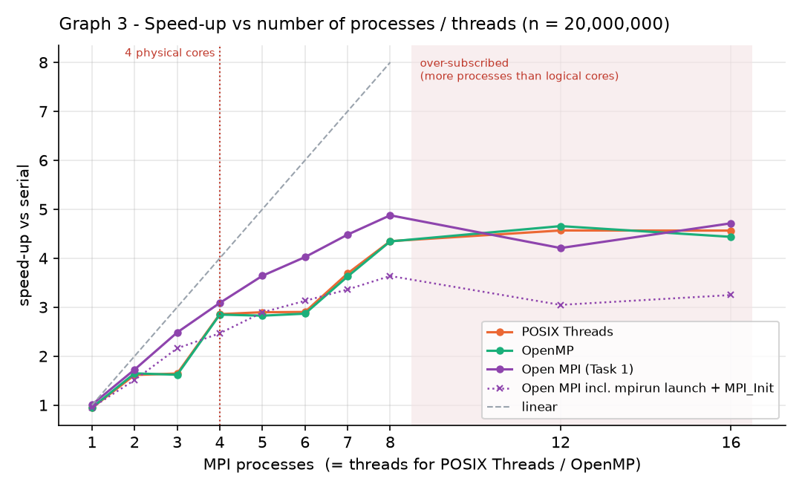
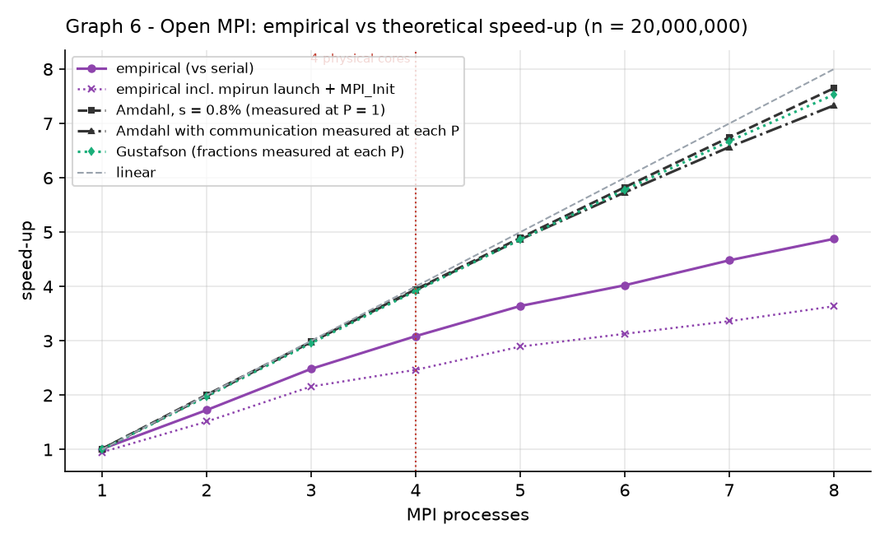

# Parallel prime search with Open MPI and OpenMP

Distributed-memory (MPI) and hybrid (MPI + OpenMP) prime search in C, with a
benchmark harness, correctness checks, SLURM jobs for a two-node cluster, and
an Amdahl's-law analysis of the measured speed-ups.

Built for FIT3143 (Parallel Computing) at Monash University, Lab #2, by
Haruto Iriyama and Hiew Jia Hao. The serial, POSIX Threads and OpenMP
baselines it is compared against are in
[fit3143-lab1](https://github.com/Haruto03/fit3143-lab1).

## What is here

- **`task1.c`** — Open MPI prime search. Four work-distribution strategies
  (block, cyclic, block-cyclic, weighted block), two kernels (trial division
  and a segmented sieve), and a per-phase timing breakdown
  (broadcast / compute / gather / merge / write) reported by the root rank.
- **`task2.c`** — Hybrid Open MPI + OpenMP version of the same program, adding
  OpenMP scheduling options (static / dynamic / guided) inside each rank.
- **`verify.sh`** — diffs every configuration against the Week 4 serial output.
- **`bench/`** — `run_bench.sh` sweeps n, process count, thread count and
  distribution and writes one CSV per machine; `plot.py` / `plot_caas.py`
  draw the speed-up, load-balance and Amdahl graphs in `bench/graphs/`.
  Raw results for an 8-thread laptop and for 1-node / 2-node cluster runs are
  in `bench/results/`.
- **`caas/`** — SLURM job scripts and their output logs from the Monash
  student cluster (up to 32 ranks over 2 nodes, Gigabit Ethernet between them).

## Results at a glance




The full set of 15 graphs is in [`bench/graphs/`](bench/graphs/). Speed-ups
are measured over the *whole* process (including the serial file write),
which is what limits the achievable speed-up — see the Amdahl section below.

---

## Layout

```
fit3143-lab2/
├── task1.c            Task 1: Open MPI prime search                (submit)
├── task2.c            Task 2: hybrid Open MPI + OpenMP             (submit)
├── Makefile           mpicc -O2 -Wall -Wextra
├── verify.sh          correctness: every config vs the Week 4 serial output
├── bench/
│   ├── run_bench.sh   benchmark sweeps -> results/<site>.csv (unified schema)
│   ├── plot.py        the 7 required graphs (+5 discussion graphs) from the CSV
│   ├── plot_caas.py   1-node vs 2-node graphs from the CAAS CSVs
│   └── serial_sieve.c serial baseline for the sieve kernel
└── caas/*.job         SLURM jobs for CAAS (thin wrappers around run_bench.sh)
```

The Week 4 programs are taken from [fit3143-lab1](https://github.com/Haruto03/fit3143-lab1) (the files we
submitted: serial = task1.c, POSIX Threads = task2.c, OpenMP = task3.c) and
are the speed-up baseline.  Their own timers stop before the file write, so
the harness records the wall-clock time of the whole process as `total`
(the rubric's "overall" time) and their reported time as `comp_max`.

## Usage

```
mpirun -np 8 ./task1 <n> [output_file] [dist] [chunk] [kernel]
mpirun -np 4 ./task2 <n> [output_file] [threads] [dist] [chunk] [sched] [sched_chunk] [kernel]

  dist   blockcyclic (default) | block | cyclic | wblock
  sched  static | dynamic (default) | guided        (OpenMP, task2 only)
  kernel trial (default) | sieve                      (sieve: block/wblock/blockcyclic only)
```

Both print a phase breakdown (broadcast / compute / gather / merge / write)
and a machine-readable `CSV,...` line; `PRIMES_VERBOSE=1` adds one
`RANK,...` line per rank for load-balance analysis.

## Local workflow (Docker `monashfit/fit3143`)

```bash
docker run --rm -it -v "$(pwd)/..:/work" -w /work/fit3143-lab2 monashfit/fit3143
make && ./verify.sh                       # expect "ALL MATCH"
SITE=ryzen7535hs bench/run_bench.sh all   # ~20-30 min; results in bench/results/ryzen7535hs.csv
python bench/plot.py bench/results/ryzen7535hs.csv --out bench/graphs --cores 8 --physical-cores 4   # on Windows, needs matplotlib
```

`run_bench.sh quick` validates the harness in under a minute. Set `SITE` to
something meaningful (the default is the container's random hostname) and
use one label per machine — never mix machines in one graph.

Things that silently corrupt timings locally:

* `mpirun` needs `--use-hwthread-cpus --bind-to none` (built into the
  harness). Without `--bind-to none` Open MPI pins np<=2 runs to a single
  core and the 1 x T hybrid runs come out ~2.5x too slow.
* Write the prime files to `/tmp` inside the container (harness default),
  not to the bind-mounted `/work`: the Windows mount makes the serial write
  phase 3-4x slower than it really is.

## CAAS workflow

```bash
scp -r fit3143-lab2 fit3143-lab1 <authcate>@student-caas-headnode.rep.monash.edu:~/Fit3143/
ssh <authcate>@student-caas-headnode.rep.monash.edu
cd ~/Fit3143/fit3143-lab2/caas
sbatch serial_baseline.job      # then, one at a time (1 running job per user):
sbatch task1_np8_1node.job      # task1_np8_2node, task1_np16_1node, task1_np16_2node, task1_np32_2node
sbatch task2_np4x4_2node.job
sbatch evidence_np8_2node.job   # writes the prime files to $HOME and checks task1 == task2
squeue -u $USER
```

Each job appends to `../bench/results/caas-1node.csv` or `caas-2node.csv`
with the same schema as the local runs, so the same `plot.py` works:
`python bench/plot.py bench/results/caas-2node.csv --site caas-2node`.
Comparing `caas-1node` (shared-memory transport) against `caas-2node`
(Gigabit Ethernet between nodes) is the `s_fabric` experiment from Topic 7A.

## Task 3 (Amdahl) — how the fractions are measured

Every run reports, from `MPI_Wtime` on the root:

| phase     | Amdahl role | why                                                       |
|-----------|-------------|-----------------------------------------------------------|
| broadcast | serial      | one collective, cost grows with P                         |
| compute   | parallel    | max over ranks of the local prime search                  |
| gather    | serial (+wait) | Gather/Gatherv, includes waiting for the slowest rank   |
| merge     | serial      | root-only k-way merge (skipped for block/wblock)          |
| write     | serial      | root-only file output                                     |

`plot.py` takes `s = (bcast+gather+merge+write)/total` from the P = 1 run
and draws `S(P) = 1/(s + (1-s)/P)` next to the empirical speed-up (graph 6/7),
plus a variant using the serial parts measured at each P (shows the
communication growth) and a Gustafson curve.
